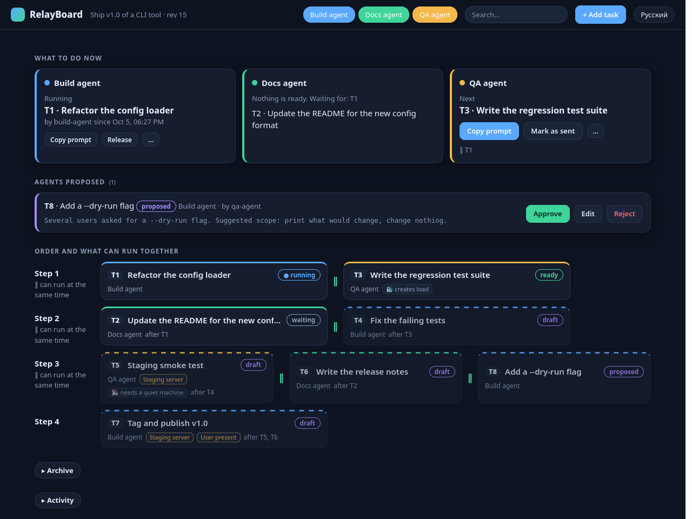

# RelayBoard

**A prompt board for people who run several AI agent sessions at once.**
Your planner agent writes the prompts, you copy them into the other sessions, and the board keeps track of the order, what depends on what, what may run in parallel, and who is holding the GPU. It ships as an **agent skill** (so your agent can run it for you) plus a small **browser panel** (so you can see and click).



- **No more "which prompt next?"** The panel shows what to send now, and which tasks may run together or must wait ("blocked by T1: GPU").
- **Agents manage the board themselves.** Install the skill; your agent adds tasks, writes missing prompts, records reports. Other sessions claim their task and finish it with a report.
- **Safe by construction.** Exclusive resources are leased, so two sessions cannot grab the GPU at once. Agent-added tasks wait for your approval. Nothing is ever deleted, only cancelled. Every change is logged.
- **Zero dependencies, tiny, local.** One Python file (3.9+), one JSON file, a local panel that starts on demand and exits when idle. No account, no cloud, no telemetry.

## 60-second start

```bash
git clone https://github.com/hikkian/relayboard
cd your-project
python3 /path/to/relayboard/skills/relayboard/scripts/rb.py init --lanes planner,worker-a,worker-b
python3 /path/to/relayboard/skills/relayboard/scripts/rb.py shim      # optional: installs a short `rb`
rb open                                                              # the panel
```

Or try the example board first:

```bash
python3 examples/build_example.py /tmp/rb-demo
cd /tmp/rb-demo && python3 /path/to/relayboard/skills/relayboard/scripts/rb.py open
```

## Install it into your AI agent

The skill is a normal [Agent Skill](https://docs.claude.com/en/docs/claude-code/skills) folder (`skills/relayboard/`: a `SKILL.md`, the `rb.py` script, the panel and prompt templates). Put that folder where your agent looks for skills:

| Agent | Where |
|---|---|
| Claude Code (plugin) | `/plugin marketplace add hikkian/relayboard`, then `/plugin install relayboard@relayboard` (or `claude plugin marketplace add hikkian/relayboard` in a shell) |
| Claude Code (manual) | copy `skills/relayboard` to `~/.claude/skills/relayboard` (all projects) or `.claude/skills/relayboard` (one project) |
| Codex CLI | copy it to `~/.codex/skills/relayboard` (Windows: `%USERPROFILE%\.codex\skills\relayboard`) |
| OpenCode and forks | copy it to `~/.config/opencode/skills/relayboard`; OpenCode also reads `~/.claude/skills` and `~/.agents/skills` |
| Anything else | paste the contents of [docs/AGENT.md](docs/AGENT.md) into the agent, or add the one-line instruction below to its `AGENTS.md` |

Paths are as documented by each tool in October 2026 ([Claude Code](https://code.claude.com/docs/en/skills), [Codex](https://developers.openai.com/codex/skills), [OpenCode](https://opencode.ai/docs/skills)); skill discovery changes over time, so check yours if the skill is not picked up. The skill needs nothing but Python 3. The plugin and marketplace manifests pass `claude plugin validate`.

Then just talk to your agent:

> "Set up a RelayBoard for this project. I run three sessions: a planner, a builder and a tester."
> "Add a task for the tester: run the regression suite on the new build. It needs the builder's task first."
> "What can I run right now? Which of those can run in parallel?"
> "Write the prompt for T4 now that T3 is done."

For agents without skills, put this in `AGENTS.md`:

```
This project uses RelayBoard. Before planning work for other sessions, read docs/AGENT.md of
https://github.com/hikkian/relayboard and use `python3 <path>/rb.py` as described there.
```

## How it works

```
        you                         planner agent                  worker sessions
         |  rb open (panel)              |  rb add / rb edit              |  rb next / claim / finish
         v                               v                                v
   +----------------------------------------------------------------------------+
   |   .relayboard/board.json   (one file, locked + atomic writes, event log)    |
   +----------------------------------------------------------------------------+
```

- **Lanes** are your sessions. A lane runs one task at a time.
- **Tasks** have a prompt, dependencies (`--needs`), exclusive resources (`--uses gpu`) and two flags: `--quiet` (needs a quiet machine) and `--noisy` (loads the CPU or the desktop). The board computes from them what is *ready*, *waiting* or *blocked*, and plans *steps*: tasks in one step may run at the same time.
- **Prompts carry their own instructions.** When you press *Copy prompt*, the board appends a short footer with the exact commands (`claim`, `finish`, `note`) and the path of `rb.py`, so even a session without the skill knows how to report.
- **Draft tasks** hold only an outline. When their turn comes the panel offers *Generate prompt*: it copies a request (outline, the reports of finished dependencies, context files, a prompt skeleton) for your agent, which writes the prompt and stores it with `rb edit`.
- **Reports** end up in a review inbox. *Accept report* unlocks dependents (or they unlock as soon as the report is written; a policy switch decides).

```
draft -> queued -> sent -> running -> review -> done        (proposed -> queued on approval; cancelled anywhere before done)
```

## The panel

| | |
|---|---|
| **What to do now** | per lane: the running task, or the next ready one with *Copy prompt* and *Mark as sent*; a line telling whether the picked tasks can run together |
| **Inbox** | proposals from agents (*Approve / Edit / Reject*) and reports to review (*Accept / Send back*) |
| **Order** | steps with parallel groups, dependency chips, resource tags, why something is blocked |
| **Details** | prompt text, notes, history, edit form, any status |
| **Archive / Activity** | finished and cancelled tasks, the event log |

English and Russian built in (auto-detected, switch in the header), dark and light themes, works on a phone. The panel polls only while its tab is visible and costs nothing when closed: the server exits after 30 idle minutes (`rb open --idle-exit 0` keeps it).


## Command line

Every command accepts `--json`. `rb --help` lists them all.

```bash
rb init --lanes main,helper               # create .relayboard/board.json here
rb add T1 --lane main --title "Build" --text-file p.md --uses gpu --by planner
rb add T2 --lane helper --title "Analyse" --outline "summarise T1's results" --needs T1 --by planner
rb plan                                   # steps and what can run together
rb next --lane helper                     # the next ready prompt for a lane (exit code 2 if none)
rb claim T1 --by worker-a                 # refused when a conflicting task is running
rb finish T1 --report reports/t1.md --by worker-a
rb gen T2                                 # request that makes an agent write T2's prompt
rb open                                   # panel;  rb export board.html  = read-only snapshot
```

Person-only actions (`approve`, `accept`, `sent`, `status`, `restore`, `purge`, `trust`) need `--human` (or `RB_ACTOR=human`); the panel does them for you. See [docs/PROTOCOL.md](docs/PROTOCOL.md) for every rule and the file format.

## Safety model

RelayBoard prevents accidents, not malice. Identities are self-declared (`--by`), so any process on your machine that can run `rb` can claim to be you. What it does guarantee:

- all writes are atomic and serialised by a file lock; two agents racing for one GPU cannot both win (tested with threads and processes);
- agents cannot approve, accept, set arbitrary statuses, purge, or finish a task another agent holds;
- tasks are never deleted by agents, only cancelled; the event log is append-only;
- the panel server binds to loopback only, rejects foreign `Host` and `Origin` headers and writes only through one guarded endpoint (a custom header, so another website cannot post to it);
- the panel never reads files named in tasks (report paths are shown, not opened).

Keep secrets out of prompts and notes: the board is plain JSON in your project folder (add `.relayboard/` to `.gitignore` unless you want to commit it).

## Requirements and platforms

Python 3.9 or newer, any OS. CI runs the tests on Linux, macOS and Windows. The panel needs any modern browser. If you want it as an always-on-top window, open it in an app window (`chromium --app=URL`) and pin it with your window manager.

## Development

```bash
python3 -m unittest discover -s tests -v     # no dependencies
python3 examples/build_example.py /tmp/demo  # an example board
```

The whole tool is `skills/relayboard/scripts/rb.py` (logic, CLI, server) and `panel.html` next to it. Contributions that keep it dependency-free are welcome.

## License

MIT, see [LICENSE](LICENSE).
