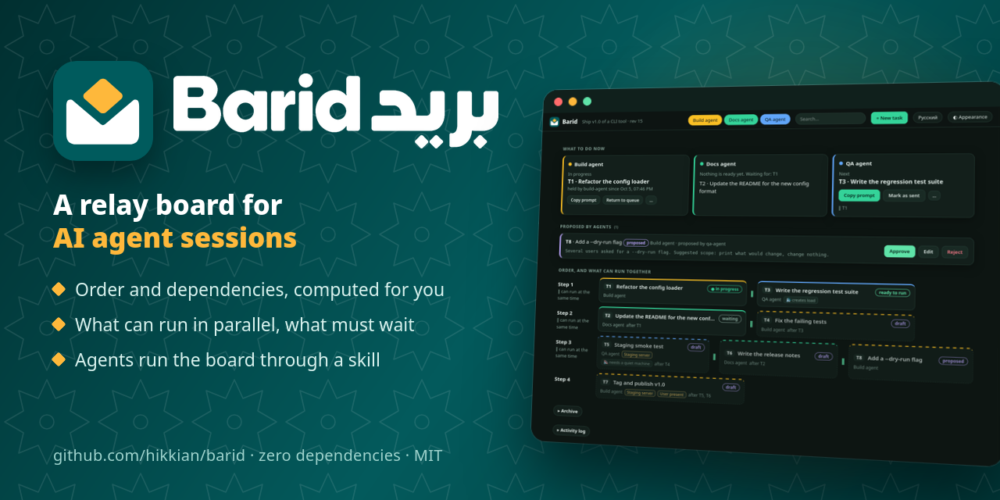
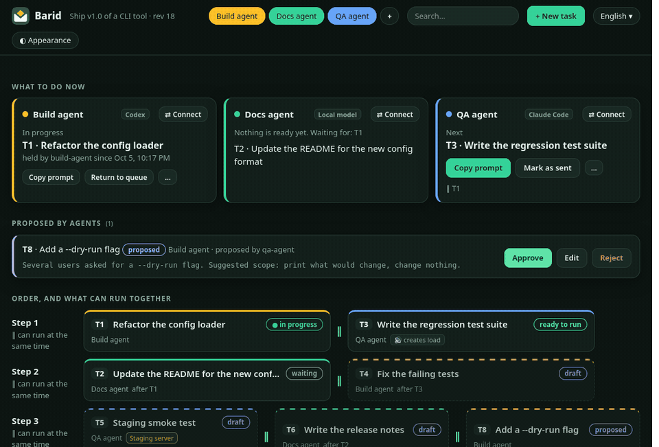
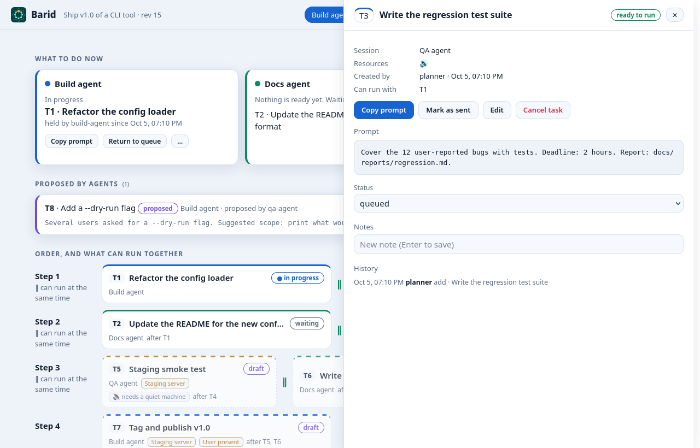

<p align="center"></p>

<p align="center">
<a href="https://github.com/hikkian/barid/actions/workflows/ci.yml"></a>


</p>

<p align="center"><a href="README.md">English</a> · Русский · <a href="README.kz.md">Қазақша</a></p>

**Доска промптов для тех, кто ведёт сразу несколько сессий ИИ-агентов.**
Агент-планировщик пишет промпты, вы копируете их в остальные сессии, а доска следит за порядком, зависимостями, тем, что можно запускать параллельно и что может столкнуться: общий GPU или тестовый сервер, одни и те же файлы или одна и та же сессия. Она поставляется как **agent skill** (чтобы ваш агент мог управлять ею за вас) и небольшая **браузерная панель** (чтобы вы могли всё видеть и нажимать).



- **Больше никаких «какой промпт следующий?»** Панель показывает, что отправить сейчас, какие задачи можно запускать вместе, а какие должны подождать («заблокировано T1: GPU», «те же файлы: src/api»).
- **Агенты сами управляют доской.** Установите skill, и ваш агент будет добавлять задачи, дописывать недостающие промпты и записывать отчёты. Остальные сессии берут свою задачу в работу и завершают её отчётом.
- **Безопасно по построению.** Эксклюзивные ресурсы (GPU, тестовый сервер, «пользователь за компьютером») выдаются в аренду, а области файлов вместе с проверкой через git ловят сессии, которые правят одни и те же файлы, так что сессии не наступают друг другу на пятки. Задачи, добавленные агентами, ждут вашего одобрения. Ничего не удаляется, только отменяется. Каждое изменение попадает в журнал.
- **Без зависимостей, крошечный, локальный.** Один Python-файл (3.9+), один JSON-файл, локальная панель, которая запускается по требованию и завершается при простое. Ни аккаунта, ни облака, ни телеметрии.

## Быстрый старт за 60 секунд

```bash
git clone https://github.com/hikkian/barid
cd your-project
python3 /path/to/barid/skills/barid/scripts/barid.py init --lanes planner,worker-a,worker-b
python3 /path/to/barid/skills/barid/scripts/barid.py shim      # optional: installs a short `barid`
barid open                                                              # the panel
```

Или сначала попробуйте пример доски:

```bash
python3 examples/build_example.py /tmp/barid-demo
cd /tmp/barid-demo && python3 /path/to/barid/skills/barid/scripts/barid.py open
```

## Установка в вашего ИИ-агента

Skill — это обычная папка [Agent Skill](https://docs.claude.com/en/docs/claude-code/skills) (`skills/barid/`: файл `SKILL.md`, скрипт `barid.py`, панель и шаблоны промптов). Положите эту папку туда, где ваш агент ищет skills:

| Агент | Куда |
|---|---|
| Claude Code (плагин) | `/plugin marketplace add hikkian/barid`, затем `/plugin install barid@barid` (или `claude plugin marketplace add hikkian/barid` в shell) |
| Claude Code (вручную) | скопируйте `skills/barid` в `~/.claude/skills/barid` (для всех проектов) или `.claude/skills/barid` (для одного проекта) |
| Codex CLI | скопируйте в `~/.codex/skills/barid` (Windows: `%USERPROFILE%\.codex\skills\barid`) |
| OpenCode и его форки | скопируйте в `~/.config/opencode/skills/barid`; OpenCode также читает `~/.claude/skills` и `~/.agents/skills` |
| Всё остальное | вставьте содержимое [docs/AGENT.md](docs/AGENT.md) в агента или добавьте однострочную инструкцию ниже в его `AGENTS.md` |

Пути приведены так, как их описывает документация каждого инструмента на октябрь 2026 года ([Claude Code](https://code.claude.com/docs/en/skills), [Codex](https://developers.openai.com/codex/skills), [OpenCode](https://opencode.ai/docs/skills)); механизм поиска skills со временем меняется, так что если skill не подхватился, сверьтесь с документацией своего агента. Для skill нужен только Python 3. Манифесты плагина и маркетплейса проходят `claude plugin validate`.

После этого просто говорите с агентом:

> «Настрой Barid для этого проекта. У меня три сессии: планировщик, разработчик и тестировщик.»
> «Добавь задачу для тестировщика: прогнать регрессионные тесты на новой сборке. Сначала должна выполниться задача разработчика.»
> «Что я могу запустить прямо сейчас? Что из этого можно запускать параллельно?»
> «Напиши промпт для T4: T3 уже готова.»

Для агентов без поддержки skills добавьте это в `AGENTS.md`:

```
This project uses Barid. Before planning work for other sessions, read docs/AGENT.md of
https://github.com/hikkian/barid and use `python3 <path>/barid.py` as described there.
```

## Как это работает

```
        you                         planner agent                  worker sessions
         |  barid open (panel)              |  barid add / barid edit              |  barid next / claim / finish
         v                               v                                v
   +----------------------------------------------------------------------------+
   |   .barid/board.json   (one file, locked + atomic writes, event log)    |
   +----------------------------------------------------------------------------+
```

- **Сессии** (lanes) — это ваши сессии агентов. В одной сессии одновременно выполняется одна задача.
- **Задачи** имеют промпт, зависимости (`--needs`), эксклюзивные ресурсы (`--uses gpu`) и два флага: `--quiet` (нужна тихая машина) и `--noisy` (нагружает CPU или рабочий стол). По ним доска вычисляет, что *готово* (ready), что *ждёт* (waiting), а что *заблокировано* (blocked), и строит *шаги*: задачи одного шага можно запускать одновременно.
- **Промпты несут свои инструкции.** Когда вы нажимаете *Скопировать промпт*, доска дописывает в конец короткий футер с точными командами (`claim`, `finish`, `note`) и путём к `barid.py`, так что даже сессия без skill знает, как отчитаться.
- **Черновики задач** хранят только набросок. Когда подходит их очередь, панель предлагает *Сгенерировать промпт*: она копирует запрос для вашего агента (набросок, отчёты завершённых зависимостей, контекстные файлы, каркас промпта), а агент пишет промпт и сохраняет его через `barid edit`.
- **Отчёты** попадают во входящие на проверку. *Принять отчёт* разблокирует зависимые задачи (либо они разблокируются сразу, как только отчёт написан: это решает переключатель политики).

```
draft -> queued -> sent -> running -> review -> done        (proposed -> queued on approval; cancelled anywhere before done)
```

## Два (и больше) разных агента в одном проекте

Barid всё равно, какой агент стоит за сессией: Claude Code и Codex, Claude Code и локальная модель, три окна Codex. Дайте каждому свою сессию и укажите, что это за агент:

```bash
barid init --lanes "claude:Claude Code,codex:Codex,local:Local model"
barid lane edit claude --agent claude --color "#ff8fb3" --human
barid lane edit local  --agent local  --color "#86f9e4" --human
```

Что позволяет им работать как команде:
- **Передача.** Когда задача завершена, промпт каждой зависящей от неё задачи автоматически начинается с короткой передачи: кто выполнил (сессия и агент), итог, путь к отчёту, ветка и worktree, сколько файлов изменено и каких, а также последние заметки. Агенту, который продолжает работу, не нужно, чтобы вы что-то пересказывали.
- **Одни правила для всех.** Сам промпт содержит команды для claim и finish, область файлов и защищённые пути, так что неважно, читает ли агент `CLAUDE.md`, `AGENTS.md` или ни то ни другое.
- **Подсказка для небольших моделей.** Сессия, где агент — `local`, получает ещё одну строку: выполнять шаги по одному, запускать команды ровно так, как написано, и сообщать, если шаг непонятен.
- **Без столкновений.** Эксклюзивные ресурсы, области файлов и отдельные worktree действуют между агентами одинаково (см. выше).

## Чем это отличается от других?

Несколько инструментов уже помогают работать с более чем одним агентом. Barid — небольшой инструмент с другим центром тяжести, поэтому вот честная карта (по состоянию на октябрь 2026; проверяйте их страницы, они быстро меняются):

| | Чем в основном занимается | Чем отличается от Barid |
|---|---|---|
| [Claude Squad](https://github.com/smtg-ai/claude-squad) | Терминальный UI, который запускает несколько агентов, каждого в своём git worktree | Он запускает сессии и сам их хостит; Barid ничего не запускает, он планирует работу и отдаёт вам промпты |
| [Vibe Kanban](https://github.com/BloopAI/vibe-kanban) | Канбан-приложение, которое запускает coding-агентов по карточкам и проверяет результаты | Оно само оркестрирует агентов; с Barid вы остаётесь посередине и пользуетесь уже открытыми окнами |
| [MCP Agent Mail](https://github.com/Dicklesworthstone/mcp_agent_mail) | Обмен сообщениями между агентами: идентичности, почтовые ящики и рекомендательные аренды файлов | Агенты общаются друг с другом через MCP-сервер; в Barid нет чата между агентами и не нужен MCP |
| [Aqua](https://github.com/vignesh07/aqua) | Общая очередь задач с атомарным захватом и блокировкой файлов для CLI-агентов | Ближе всего по духу. Aqua позволяет агентам брать задачи из очереди; Barid ещё хранит текст промпта, планирует порядок и параллельные шаги и фиксирует честный итог |
| Claude Code agent teams | Ведущий агент, который порождает напарников и руководит ими внутри Claude Code | Работает внутри одного продукта; Barid работает между продуктами (Claude Code, Codex, OpenCode, локальная модель) |

Что добавляет Barid, по одной строке:

- **Единица работы — промпт.** Доска хранит текст, который вы вставите, может держать задачу черновиком, пока планировщик не напишет её промпт, и передаёт результат завершённой задачи следующей.
- **Вы остаётесь в контуре намеренно.** Ничего не запускается и не контролируется. Подойдёт любое окно чата или терминал, где можно выполнить команду, а агент может только предлагать, брать в работу и завершать свою собственную задачу.
- **Честные завершения.** Остановленный, частичный или упавший запуск никогда сам не разблокирует зависящие от него задачи; решаете вы.
- **Один файл, без демона.** Только Python, доска в JSON, панель по желанию. Ни MCP-сервера, ни базы данных, ни API-ключей.

Для кого это не подходит: если вам нужно, чтобы агенты работали без присмотра, сами разбивали цель на подзадачи и сливали ветки, берите оркестратор из таблицы. Barid для тех, кто предпочитает держать руль в своих руках.

## Как не дать сессиям мешать друг другу

Две сессии редко конфликтуют только из-за GPU: они ещё и перезаписывают файлы друг друга. Barid решает это на четырёх уровнях:

1. **Эксклюзивные ресурсы** (`--uses gpu`): только одна задача за раз (как описано выше).
2. **Области файлов** (`--touches src/gateway,tests`): файлы, папки или glob-шаблоны, которые задача может менять. Задачи с пересекающимися областями никогда не запускаются вместе, и панель объясняет почему («ждёт T1, те же файлы: src/gateway.py»). Проверка пересечения консервативна: она может заблокировать две задачи, которые на деле не конфликтовали бы, но никогда наоборот.
3. **Защищённые пути** (`barid protect add config/live.json`): файлы, которые не должна менять ни одна задача. Barid считает контрольную сумму, когда задача берётся в работу, и сравнивает её по завершении.
4. **Изолированные checkout'ы** (`barid worktree T1`): собственный git worktree и ветка для задачи, прописанные в её промпте («работай только в ...»). Задачи в разных worktree не могут перезаписать друг друга, их работа встречается только при слиянии.

Когда задача завершается, Barid также спрашивает у git, что изменилось с момента claim, и помечает всё, что **вне области задачи**, всё, что **внутри области другой выполняющейся задачи**, и любой изменённый **защищённый файл**. Отчёт с такими пометками никогда сам не разблокирует зависимые задачи, даже если в нём написано *complete*: он ждёт во входящих вместе со списком файлов. `barid check T1` показывает, что может столкнуться, ещё до старта.

Это **обнаружение плюс соглашение, а не песочница**: агент по-прежнему может записать любой файл, на запись которого у него есть права. Промпт сообщает ему правила, worktree держит его изменения отдельно, а Barid делает так, что нарушения невозможно не заметить. Для жёстких гарантий сочетайте его с правами на уровне ОС или контейнерами.

## Панель

| | |
|---|---|
| **Что делать сейчас** | по каждой сессии: выполняемая задача или следующая готовая, с *Скопировать промпт* и *Отметить как отправленный*; строка о том, можно ли запускать выбранные задачи вместе |
| **Входящие** | предложения от агентов (*Одобрить / Редактировать / Отклонить*) и отчёты на проверку (*Принять / Вернуть на доработку*) |
| **Порядок** | шаги с параллельными группами, чипы зависимостей, теги ресурсов, причина блокировки |
| **Детали** | текст промпта, заметки, история, форма редактирования, любой статус |
| **Архив / Активность** | завершённые и отменённые задачи, журнал событий |

Встроены английский и русский (определяются автоматически, переключаются в шапке), светлая, тёмная или автоматическая тема и четыре цветовые палитры (Forest, Teal, Graphite, Midnight) через кнопку *Оформление*; работает на телефоне. Из того же меню можно **назвать и раскрасить каждую сессию** и указать, какой **агент** в ней работает (Claude Code, Codex, OpenCode, Gemini CLI, Cursor, Aider, локальная модель или любое имя); агент отображается бейджем на сессии. Панель опрашивает сервер, только пока её вкладка видна, и ничего не стоит, когда закрыта: сервер завершается после 30 минут простоя (`barid open --idle-exit 0` оставляет его работать).



## Командная строка

Каждая команда принимает `--json`. `barid --help` перечисляет их все.

```bash
barid init --lanes main,helper               # create .barid/board.json here
barid add T1 --lane main --title "Build" --text-file p.md --uses gpu --by planner
barid add T2 --lane helper --title "Analyse" --outline "summarise T1's results" --needs T1 --by planner
barid plan                                   # steps and what can run together
barid next --lane helper                     # the next ready prompt for a lane (exit code 2 if none)
barid claim T1 --by worker-a                 # refused when a conflicting task is running
barid finish T1 --report reports/t1.md --by worker-a
barid gen T2                                 # request that makes an agent write T2's prompt
barid move T3 1                              # priority: earlier in the list = earlier slot in the plan
barid add T3 --lane a --touches src/api --text-file p.md   # file scope: overlapping scopes never run together
barid protect add config/live.json        # no task may change it (verified at finish)
barid worktree T3                         # an isolated git worktree and branch for the task
barid check T3                            # what could collide with it
barid lane edit a --title Builder --color "#7c5cff" --agent codex   # name, colour and agent of a session
barid open                                   # panel;  barid export board.html  = read-only snapshot
```

Действия только для человека (`approve`, `accept`, `sent`, `status`, `restore`, `purge`, `trust`) требуют `--human` (или `BARID_ACTOR=human`); панель выполняет их за вас. Все правила и формат файла описаны в [docs/PROTOCOL.md](docs/PROTOCOL.md).

## Модель безопасности

Barid предотвращает ошибки, а не злой умысел. Идентичности заявляются самими участниками (`--by`), так что любой процесс на вашей машине, который может запустить `barid`, способен выдать себя за вас. Что он при этом гарантирует:

- все записи атомарны и сериализуются файловой блокировкой; два агента, борющиеся за один GPU, не могут выиграть оба (проверено на потоках и процессах);
- агенты не могут одобрять, принимать, выставлять произвольные статусы, делать purge и завершать задачу, которую держит другой агент;
- изменения файлов вне объявленной области задачи, в области другой выполняющейся задачи или в защищённых путях обнаруживаются по окончании задачи и оставляют зависимые задачи заблокированными, пока вы не решите;
- агенты никогда не удаляют задачи, только отменяют их; журнал событий только дополняется;
- сервер панели слушает только loopback, отклоняет чужие заголовки `Host` и `Origin` и пишет только через один защищённый эндпоинт (с кастомным заголовком, так что другой сайт не может отправить в него POST);
- панель никогда не читает файлы, указанные в задачах (пути к отчётам показываются, но не открываются).

Не храните секреты в промптах и заметках: доска — это обычный JSON в папке вашего проекта (добавьте `.barid/` в `.gitignore`, если не хотите коммитить её).

## Статус

Я сделал Barid для себя, чтобы не терять из виду собственные окна агентов. Если он вам пригодится, пользуйтесь; идеи и баг-репорты приветствуются, но это проект одного человека, и быстрых ответов я обещать не могу.

Версия 0.4, автор пользуется ею каждый день, ведя две сессии агентов. Основная платформа — Linux; macOS и Windows покрыты CI, но реального использования там было мало, и ничего из этого не пробовали на GPU от AMD или Intel (самому Barid GPU безразличен: он лишь отслеживает, кто занимает общий ресурс). Баг-репорты с выводом `barid doctor` очень приветствуются.

## Требования и платформы

Python 3.9 или новее, любая ОС. CI запускает тесты на Linux, macOS и Windows. Для панели подойдёт любой современный браузер. Если хотите видеть её как окно поверх остальных, откройте её в окне приложения (`chromium --app=URL`) и закрепите средствами оконного менеджера.

## Разработка

```bash
python3 -m unittest discover -s tests -v     # no dependencies
python3 examples/build_example.py /tmp/demo  # an example board
```

Весь инструмент — это `skills/barid/scripts/barid.py` (логика, CLI, сервер) и лежащий рядом `panel.html`. Приветствуются вклады, которые сохраняют отсутствие зависимостей.

## Название

*Barid* (بريد) — арабское слово, означающее «почта». Так же называлась эстафетная почтовая служба ранних халифатов: гонцы передавали сообщения от станции к станции вдоль цепочки постов. Промпты здесь — сообщения, сессии ваших агентов — станции, а это доска, которая держит эстафету в порядке. (Первое рабочее название было RelayBoard; старые имена `rb`, `RB_*` и `.relayboard` по-прежнему работают.)

## Участие, безопасность, лицензия

См. [CONTRIBUTING.md](CONTRIBUTING.md) и [SECURITY.md](SECURITY.md). Лицензия MIT, см. [LICENSE](LICENSE). Copyright (c) 2026 hikkian.
